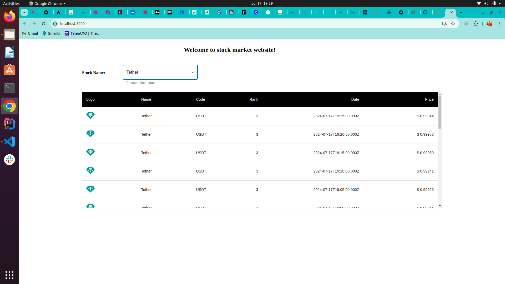
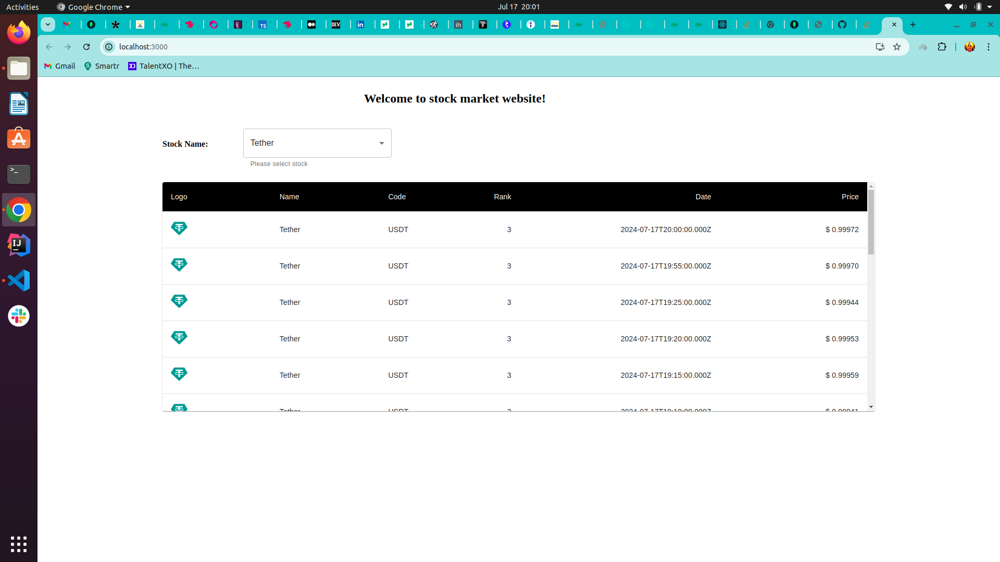

## Prerequisites

- Node

To start backend service. execute below commands

    $ cd backend
    $ npm start

Backend will start at port 5000. To test stocks API hit this link: http://localhost:5000/stock

To start frontend. execute below commands

    $ cd frontend
    $ npm start

Finally open the below link in the browser to test the routes: http://localhost:3000/

Stock data will be refreshed automatically for every 5-6 minutes. LiveCoinWatch will poll data for every 5mins.

Web application looks in the below format

